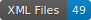

CREMMA - A repository of 17th century manuscripts
=================================================

    

--- 

CREMMA HTR GT for 17th century MSS

## Description du repository

## Description of data

| Title                                                                                                         | Type   | Genre   |   Files | Source   |
|---------------------------------------------------------------------------------------------------------------|--------|---------|---------|----------|
| [recueil-lettres-pieces](data/recueil-lettres-pieces)                                                         | Unkown | Microf. |      11 | [Link](https://gallica.bnf.fr/ark:/12148/btv1b9060535w) |
| [dépêches-originales-adressées-à-la-cour-par-divers](data/dépêches-originales-adressées-à-la-cour-par-divers) | Unkown | Microf. |      25 | [Link](https://gallica.bnf.fr/ark:/12148/btv1b10724071x) |
| [lettres-de-bossuet](data/lettres-de-bossuet)                                                                 | Unkown | Microf. |      18 | [Link](https://gallica.bnf.fr/ark:/12148/btv1b100938691) |
| [correspondance-dom-bernard-de-montfaucon](data/correspondance-dom-bernard-de-montfaucon)                     | Unkown | Color   |      20 | [Link](https://gallica.bnf.fr/ark:/12148/btv1b52502907k) |
| [correspondance-dom-bernard-de-montfaucon-vol3](data/correspondance-dom-bernard-de-montfaucon-vol3)           | Unkown | Color   |      29 | [Link](https://gallica.bnf.fr/ark:/12148/btv1b10506222k) |
| [pensées-sur-la-religion-par-blaise-pascal](data/pensées-sur-la-religion-par-blaise-pascal)                   | Unkown | Color   |       8 | [Link](https://gallica.bnf.fr/ark:/12148/btv1b52504189f) |
